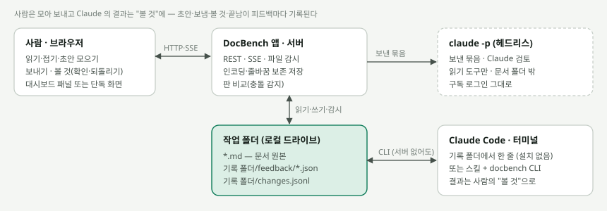

# DocBench

사람과 AI가 같은 문서를 **읽고 · 피드백하고 · 고치고 · 기록**하는 작업대.

- **보기**: 제목 깊이별 접기(상태 기억), 근거 표기 칩(`[실측]` `[추정]` …), 빈칸 형광, 이름표 거르기, 찾기, 개요. 왼쪽은 탐색기 — 펼친 폴더만 읽어 드라이브를 통째로 열어도 바로 뜨고, 자주 쓰는 문서·폴더는 "작업 중"에 고정한다
- **피드백**: 섹션·접힌 덩어리·고른 문구에 단다. 카드마다 "누구 차례"(사람 / AI)가 있고 대화가 이어진다. 본문의 표시에 마우스를 올리면 그 피드백이, 카드에 올리면 본문의 그 자리가 보인다
- **Claude 작업**: Claude 차례 피드백을 넘기면 Claude 가 **백그라운드에서**(모델·노력 선택) 처리한다 — 분명한 요청은 바로 고치고, 큰 변경은 제안, 모르면 질문. 진행 로그가 화면 아래 창에 실시간으로 보인다
- **편집**: 섹션 단위 편집 → 미리보기 → 차이 → 저장. 그 사이 바뀌었으면 다른 섹션은 자동 재적용, 같은 섹션은 내 글을 지키고 차이를 보여 준다
- **기록**: 마지막으로 본 뒤 바뀐 글을 문서 위에 바로 표시(더한 글 초록 · 지운 글 취소선 · 누가·언제), 섹션별 변경 이력, 커밋본(git HEAD) 대비 차이, 폴더 지도. 에디터·터미널 등 도구 밖에서 고쳐도 몇 초 안에(창으로 돌아오면 바로) 따라온다

열자마자 쓴다. 처음 열면 이름도 폴더도 묻지 않고 연습용 문서가 든 "시작하기" 작업대가 뜬다. 계정은 저절로 생기고(표시 이름은 오른쪽 위 "나"에서), 기록 자리는 처음 저장할 때, Claude 연결은 처음 맡길 때 그 자리에서 묻는다.

문서 원본은 언제나 **문서 폴더의 `.md` 파일**이다. 피드백·이력은 사람도 읽을 수 있는 JSON 으로 **기록 폴더**에 남는다 — 기본은 문서 폴더 밖의 "기록 보관함"이라 문서 폴더에는 문서만 있다(같은 폴더에서 일하는 다른 프로그램·다른 Claude 세션이 헷갈리지 않게). 팀이 git 으로 함께 쓰려면 문서 폴더 안 `.docbench/` 에 둘 수도 있다.



## 쓰는 법

| | 언제 | 어떻게 |
|---|---|---|
| **파일 하나 (서버 없음)** | 설치 없이 바로 | [`release/docbench.html`](release/docbench.html) 을 엣지·크롬으로 연다 → 왼쪽 위 메뉴의 **폴더 열기**. 보기만 할 때는 아무것도 만들지 않고, 처음 저장할 때 기록 보관함(예: HTML 옆 빈 폴더)을 한 번 고른다 |
| **DocBench 앱** | 이 PC 의 여러 폴더를 한곳에서, Claude 작업까지 | `docbench app --open` — 이 PC 에 하나 켜 두는 작은 서비스. 고르기 창 없이 폴더를 둘러보고 더한다(드라이브도 바로). 로그인 때 켜기(`--startup on`) |
| **대시보드 탭** | 사내 대시보드에 VS Code 확장처럼 (백엔드 언어 무관) | 앱의 `host.js` 를 싣고 `DocBenchHost.mount(탭, { root, key })` — 테마·할 일 배지·"Claude 에게 넘기기"를 대시보드 터미널로 → [docs/PORTING.md §2](docs/PORTING.md) · [examples/dashboard-tab](examples/dashboard-tab) · Claude Code 스킬 `docbench-setup` 이 대신 붙인다 |
| **대시보드에 직접 끼우기** | Node 대시보드에 같은 출처로, 대시보드 인증 그대로 | `<doc-bench api="/docbench/api">` + 처리기·프록시 → [docs/PORTING.md §3](docs/PORTING.md) |
| **claude.ai 아티팩트** | 로컬 없이 공유·코멘트 | `createArtifactAdapters()` → [docs/claude-artifact.md](docs/claude-artifact.md) |

화면 코드는 모두 같다. 저장소·인증·AI 연결만 **어댑터**로 갈아 끼운다([docs/ARCHITECTURE.md](docs/ARCHITECTURE.md)).
로컬에서 쓰는 길(파일 하나·앱·탭·`serve`·CLI)은 같은 기록 폴더를 쓰므로 섞어 써도 피드백·이력이 이어진다(브라우저로 만든 기록은 연결 문구의 `docbench link` 가 한 번 이어 준다).
하위 폴더를 따로 열어 쓰던 기록은 넓은 폴더를 열 때 합치자고 묻는다 — 같은 문서의 기록이 두 벌이 되지 않게.

## 빠르게 켜 보기

설치 없이: `release/docbench.html` 을 엣지·크롬으로 연다 → "시작하기"에서 둘러본 뒤 **폴더 열기** → `examples/sample-workspace`(예제는 기록이 폴더 안 `.docbench/` 에 들어 있어 그대로 이어 쓴다).

저장소에서:

```bash
npm install                                             # 빌드(dist/)까지 한다 — Node 20.11 이상
node bin/docbench.mjs app --open                        # DocBench 앱 → 브라우저가 열린다(열쇠 붙은 주소, 한 번 열면 기억)
node bin/docbench.mjs serve examples/sample-workspace   # 또는 폴더 하나만 → http://127.0.0.1:4317/
```

예제 폴더에는 일부러 까다로운 문서(같은 이름 제목, `9/29~10/2` 물결표, UTF-8 BOM+CRLF, EUC-KR)가 들어 있다.

## 사람 ↔ Claude 한 바퀴

**화면에서 (Claude 작업)** — 피드백을 "Claude가 처리"로 남기고 위쪽 **"Claude에게 넘기기"** → 아래 창에서 모델·노력·방식을 고르고 **시작**.

```
화면                                       DocBench 앱 · serve (이 PC 에서)
────                                       ─────────────────────────────────
넘기기 (모델 sonnet · 노력 high)  ──▶  <기록 폴더>/runs/<id>.req.json
                                          claude -p --restricted --safe-mode --permission-mode dontAsk
                                                    --tools Read,Grep,Glob --add-dir <문서 폴더>   (문서 폴더 밖에서 실행)
진행 로그 (읽음·찾음·고침…)       ◀──  <기록 폴더>/runs/<id>.log.jsonl
문서에 바뀐 글 표시 · 카드 회신   ◀──  반영은 DocBench 가: 판 비교·잠금·인코딩 보존·이력
```

- Claude 는 문서 폴더 안을 **읽기만** 한다. 고친 섹션은 정해진 모양으로 돌려주고, 실제 쓰기는 앱·서버가 docbench 규칙으로 한다 — 그 사이 사람이 같은 섹션을 고쳤으면 덮지 않고 제안으로 돌린다. 지켜보는 사람이 없는 실행이라 문서 속 글이 Claude 를 속여도(프롬프트 주입) 명령 실행·폴더 밖 읽기는 할 수 없다([docs/SECURITY.md](docs/SECURITY.md)).
- 카드의 **"Claude 제안"** 도 같은 길로 — 문서는 건드리지 않고 고친 섹션을 제안으로 올린다. 화면에서 차이를 보고 적용·거절.
- 구독 로그인(Claude Code)을 그대로 쓰며 API 키가 필요 없다. 로그인하지 않았거나 필요한 플래그가 없는 옛 Claude Code 면 실행하지 않고 그 자리에서 할 일(`claude auth login`·`claude update`)을 알려 준다.
- 단일 HTML 은 페이지가 PC 프로그램을 켤 수 없어서, 처음 맡길 때 Claude 작업 창이 **연결 문구**를 준다. Claude Code 에 붙여 넣으면 CLI 파일 하나([`release/docbench.mjs`](release/docbench.mjs))를 받아 지문을 확인하고, 앱을 켜고, 이 화면의 계정과 짝짓는다(`docbench link --owner`). 연결되면 하던 넘기기를 이어 간다. 짝지은(또는 이름이 같은) 앱만 저절로 고른다 — 폴더를 함께 쓰는 동료의 PC·구독으로 돌지 않게.
- 앱·`docbench serve` 는 Claude 작업을 기본으로 켠다(`serve --no-claude` 로 끔). 대시보드에 직접 끼우는 처리기는 기본 끔 — 이 PC 사람 한 명이 쓰는 대시보드면 `runs: true`.

**터미널에서 (Claude Code)** — 대화하며 처리하고 싶을 때:

```
사람 (브라우저)                         Claude Code (터미널)
───────────────                         ────────────────────
섹션에 피드백 "근거 보강해"   ──파일──▶  docbench fb list --waiting assistant
                                         docbench fb show <id>        # 피드백 + 지금 섹션 원문
                                         docbench doc write <문서> --section "<키>" --base <판> --file new.md --fb <id>
화면에 바뀐 글 표시          ◀──감시──   docbench fb reply <id> -m "보강함" --resolve
카드가 '반영됨' 으로
```

- Claude Code 플러그인으로 스킬 둘과 CLI 를 깐다: `claude plugin marketplace add d-j-lee/docbench` → `claude plugin install docbench@docbench`
  — `docbench-setup`(대시보드·폴더에 붙이기)과 `docbench-feedback`(피드백 처리). 플러그인에 CLI 파일이 들어 있어 따로 설치할 것이 없다(Node 20.11+). 작업 폴더에만 두려면 `docbench init . --claude`([integrations/claude-code](integrations/claude-code)).

## CLI

```
docbench app [--open | --detach | --status | --stop] [--allow-origin URL] [--startup on|off] [--shortcut on|off] [--port N]
docbench serve [폴더] [--data 기록폴더] [--port 4317] [--token T] [--allow-origin URL] [--no-claude]
docbench init [폴더] [--data 기록폴더 | --inside] [--claude]
docbench link <폴더> [--data 기록폴더] [--owner 계정] [--force]
docbench status [--json]
docbench fb list|show|add|reply|propose …
docbench doc list|sections|show|write …
docbench log <문서> -m 요약 [--fb id]
docbench inbox [--clear]
docbench runner [폴더] …          # 0.3–0.4 의 폴더별 실행기 (예전 연결용 — 새로는 app)
```

CLI 는 두 가지로 받는다: 저장소(`npm install` 후 `node bin/docbench.mjs`, 서버 화면 포함) 또는 **파일 하나** [`release/docbench.mjs`](release/docbench.mjs)(`node docbench.mjs …`, 서버 화면만 빼고 전부 — CP949 용 iconv-lite 포함, Node 20.11+).
설정은 기록 폴더의 `config.json`(함께 씀)과 **이 PC 의 설정**(Windows `%LOCALAPPDATA%\docbench\config.json`, 문서 폴더 밖 — 실행 명령 `assistant`·`notify.command`, 사람 `user`·표시 이름 `name`, 기록 보관함 `dataHome`, 폴더별 기록 짝 `workspaces[<폴더>].data`·짝 계정 `owners`, 앱의 허용 출처 `app.allowOrigins` 는 여기에만). 앱의 열쇠는 그 옆 `app-token`. serve 의 토큰은 `DOCBENCH_TOKEN` 으로도 준다.
모든 명령은 `--json` 으로 기계가 읽기 좋은 출력을 낸다. 작업 폴더는 `--root` → `DOCBENCH_ROOT` → 현재 폴더에서 위로(기록 짝이 있거나 `.docbench` 가 있는 문서 폴더, 또는 지금 자리가 기록 폴더) 찾고, 기록 폴더는 `--data` → 문서 폴더 안 `.docbench` → 이 PC 의 설정의 짝 → 기록 보관함/<이름>(같은 이름의 다른 문서 폴더면 `<이름> (2)` …) 순으로 찾는다. 없으면 만들지 않고 종료 코드 2(만드는 것은 `init`·`link`·`serve`·앱에 더하기). 넓은 작업 공간으로 합쳐진 기록이면 어디로 갔는지 알리고 2.
판이 바뀐 사이 쓰기를 시도하면 3, 읽기 전용이면 4. 섹션 쓰기는 판(`--base`)이 필수이고, 제목 줄이 바뀌거나 하위 섹션이 사라지면 멈춘다. 자세한 흐름은 [docs/FEEDBACK-PROTOCOL.md](docs/FEEDBACK-PROTOCOL.md).

## 저장소 지도

```
src/core/          DOM 없는 핵심 — 섹션 키·범위, 문구 앵커, 피드백 모델, 차이, AI 프롬프트, Claude 작업 규약(runs.ts),
                   기록 폴더 규칙·탐색기 항목(workspace.ts), 기록 합치기(records.ts) — 서버·CLI 와 공유
src/ui/            화면 — 탐색기(explorer.ts), Claude 작업 창(runs.ts) 등. 컨테이너 쿼리 기반이라 어떤 패널 폭에도 맞는다
src/adapters/      memory · rest · claude-artifact · folder(로컬 폴더를 브라우저가 직접)
src/element.ts     <doc-bench> 웹 컴포넌트
src/standalone.ts  단일 HTML — 계정·시작하기·폴더 열기·기록 자리·기록 합치기
src/app-shell.ts   DocBench 앱 화면과 대시보드 탭(/embed) 화면
server/            로컬 서버 (의존성 0, Node 20.11+) — 인코딩·줄바꿈 보존, 감시, SSE, Claude 작업 엔진(runs.mjs),
                   DocBench 앱(app.mjs), 대시보드 다리(static/host.js)
bin/docbench.mjs   CLI (app·serve·init·link·fb·doc …)
integrations/      Claude Code 플러그인(스킬 docbench-setup · docbench-feedback, cli/docbench.mjs). 마켓 목록은 .claude-plugin/
release/           docbench.html(단일 HTML) · docbench.mjs(CLI 파일 하나, 앱 포함) — 빌드 없이 받아 쓴다 (npm run release 로만 갱신)
examples/          sample-workspace(까다로운 예제 문서) · dashboard-tab(언어 무관 대시보드 탭, PORTING §2) ·
                   dashboard-embed(Node 대시보드에 끼우기, §3-C) · react(래퍼) · claude-artifact(아티팩트 한 장)
docs/              설계·이식·보안·REST 계약(openapi.yaml)·결정 기록
test/              단위(vitest) · 서버(node:test) · 브라우저 e2e(Playwright)
```

## 개발

```bash
npm run typecheck   # 브라우저 TS + 서버/CLI JSDoc
npm test            # 단위 + 서버
npm run test:e2e    # Chromium 필요: npx playwright install chromium
# 실행은 Node 20.11+, 개발(npm ci 의 시험 도구)은 Node 22.22+
npm run check       # 전부
```

빌드 결과물: `dist/docbench.js`(ESM), `dist/docbench.iife.js`(전역 `DocBench`), `dist/docbench.css`, `dist/app.js`(앱 화면), `dist/core.mjs`(서버·CLI), `dist/docbench.html`(단일 HTML), `dist/docbench.mjs`(CLI 파일 하나 — 앱 화면까지 묶음), `dist/types/`.
화면·CLI 를 고쳤으면 `npm run release` 로 `release/docbench.html`·`release/docbench.mjs`·`integrations/claude-code/cli/docbench.mjs` 도 갱신해 함께 커밋한다(`npm run check` 가 다르면 실패). 단일 HTML 의 설치 안내는 같은 판 태그(`v<판>`)의 `release/docbench.mjs` 주소와 SHA-256 을 담는다 — 판을 올릴 때는 [`CHANGELOG.md`](CHANGELOG.md) 에 그 판 절을 쓰고 `main` 에 올리면 CI 가 시험을 통과한 뒤 태그와 GitHub Release(두 파일 첨부)를 만든다. 태그를 손으로 올리지 않는다.
marked·DOMPurify·jsdiff 는 번들에 들어 있어 사내망·엄격한 CSP 에서도 CDN 없이 돈다([THIRD_PARTY_NOTICES.md](THIRD_PARTY_NOTICES.md)).

## 파일 모양 보존

| 파일 | 읽기 | 저장 |
|---|---|---|
| UTF-8 (BOM 유무) | ✔ | ✔ 바이트 그대로 (BOM 유지) |
| UTF-16LE (BOM, PowerShell 5.1 기본) | ✔ | ✔ |
| CP949 / EUC-KR | ✔ (서버는 `iconv-lite` 있으면 확장 음절까지, 단일 HTML 은 브라우저 내장 디코더로 늘) | ✔ 다시 인코딩해 원래 바이트가 그대로 나올 때만. CP949 에 없는 글자(— ✅ 등)를 넣으면 막고 UTF-8 변환을 묻는다 |
| 깨진 바이트가 섞인 UTF-8, UTF-16BE | ✔ | ✘ 읽기 전용 (사람이 동의하면 UTF-8 로 정리해 저장) |
| CRLF·LF (섞여 있어도) | 화면은 LF | 손대지 않은 줄은 원래 줄바꿈 그대로, 바뀐 줄은 그 자리의 줄바꿈 |

## 알려진 한계

- 섹션은 마크다운 **제목** 단위다. 제목이 없는 긴 문서는 문서 전체 편집만 된다. 문서에 HTML 로 쓴 `<h2>` 나 `<details>` 안의 제목은 섹션이 아니다(화면과 원문이 같은 규칙).
- AI 제안·Claude 작업의 고치기는 6만 자 이하 섹션만 — 더 크면 하위 섹션에 피드백을 달라고 안내한다(잘라 보내 나머지를 지우는 일을 막는다).
- 동시 편집은 낙관적 잠금(판 비교) + 같은 문서 쓰기 줄 세우기(프로세스 안·서버와 CLI 사이 잠금 파일)다. 실시간 공동 타이핑(CRDT)은 하지 않는다.
- 단일 HTML 은 엣지·크롬(File System Access API)에서만 쓰기가 되고, 다른 브라우저·`http://사내호스트` 에서는 읽기만 된다. 감시 대신 2.5초 간격(창으로 돌아오면 바로)으로 확인하고, git 기준본은 없다. Claude 작업은 이 PC 에 앱을 켜 둬야 한다. 문서 속 바깥 주소 그림은 보이지 않고(새는 길 차단), 파일로 열면 고른 폴더·보관함을 기억하지 않는다(창마다 처음 저장할 때 한 번 묻는다).
- 큰 폴더(드라이브·홈)는 펼친 폴더의 문서만 목록·찾기·폴더 지도에 들어온다. 외부 편집 이력은 한 번이라도 연 문서부터 남는다.
- Claude 작업은 작업 공간마다 한 번에 하나씩 돈다(나머지는 줄 선다). Claude 는 작업 공간 밖을 읽지 못하므로 다른 폴더의 자료가 필요한 피드백은 질문으로 돌아온다 — 반대로 드라이브 전체를 작업 공간으로 더하면 Claude 가 읽을 수 있는 범위도 그만큼 넓어진다.
- 대시보드 탭의 사람은 그 PC 의 로그인이다(대시보드 로그인 사용자로 기록하는 것은 씨앗 S19).

## 라이선스

[MIT](LICENSE) © 2026 d-j-lee. 번들에 든 라이브러리는 [THIRD_PARTY_NOTICES.md](THIRD_PARTY_NOTICES.md).
